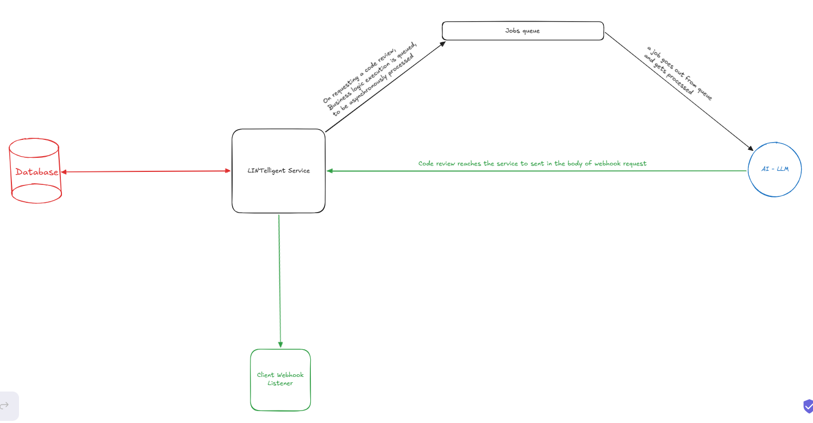

# LINTelligent

_AI-integrated backend service for code linting (ie. analyzing code for issues). Accepts code snippets via a REST API, analyzes them using LLM, and returns a structured review identifying issues by severity, line number, type, and a short human-readable explanation for each issue._

---

## Overview

When a _linting request_ reaches the system, LINTelligent service saves its details in the database then enqueues a background job for handling the request in a _job queue_ then immediately returns **202 Accepted** response to the client.

After that, a worker picks up the job from the job queue and processes it, it calls the configured LLM provider with the request details, then updates the review record with the structured LLM response (review result).

Once the review result is saved, the service notifies the client _by sending the completed review to their registered webhook URL_.

#### Basic system architecture diagram

---

## Getting Started

- You need a webhook url, if you want to get notified once the code linting is finished, you can create one online and send it with the request
- Go to [Swagger Interface](https://lintelligent-production.up.railway.app/swagger/index.html) to test the API and try the functionality

---

## Tech Stack

- ASP.NET Core Web API
- xUnit & Moq
- Hangfire
- Ollama Cloud
- PostgreSQL & Entity Framework Core
- GitHub Actions
