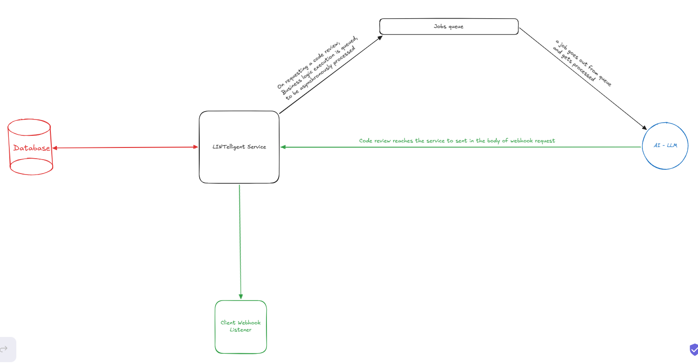

# LINTelligent

_AI-integrated backend service for code linting (ie. analyzing code for issues). Accepts code snippets via a REST API, analyzes them using LLM, and returns a structured review identifying issues by severity, line number, type, and a short human-readable explanation for each issue._

---

## Overview

When a _linting request_ reaches the system, LINTelligent service persists its data in the database then enqueues a background job for handling reqeust in a _job queue_ then immediately returns **202 Accepted** response to the client.

After that, a worker picks up the job from the job queue and process it, it calls the configured LLM provider, and persists the structured LLM response (review result) to database with the initially saved record (that was before returning 202 Accepted result).

Once the review result is saved, the service notifies the client _by sending the completed review to their registered webhook URL_.

#### Basic system architecure diagram

